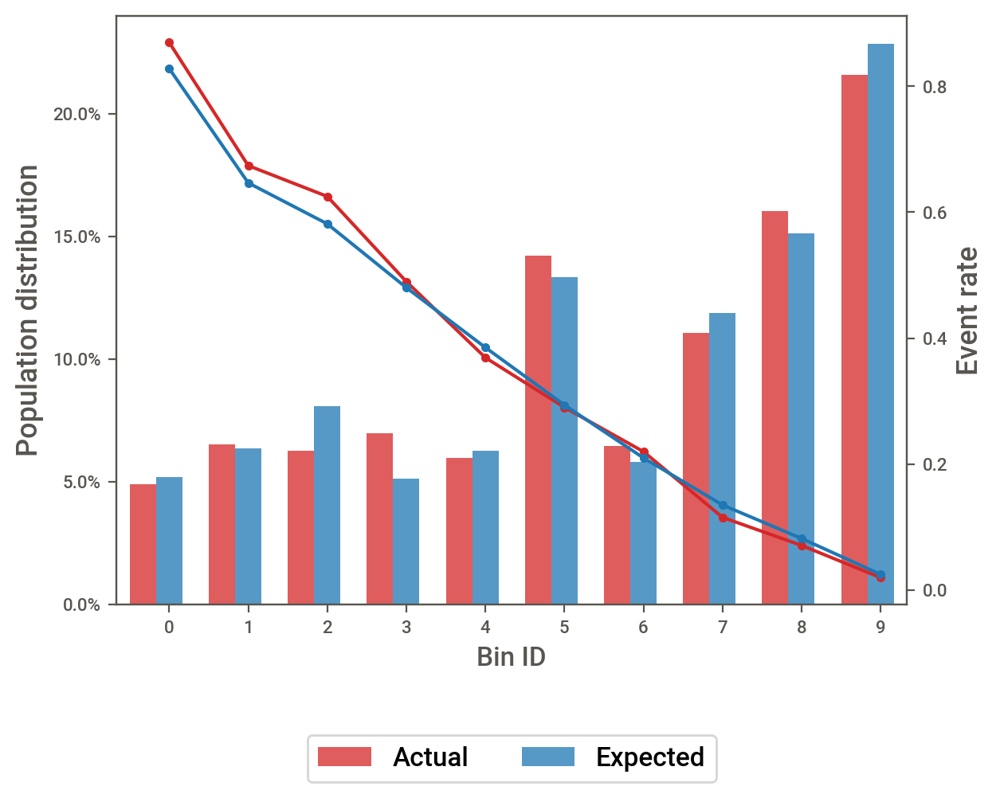
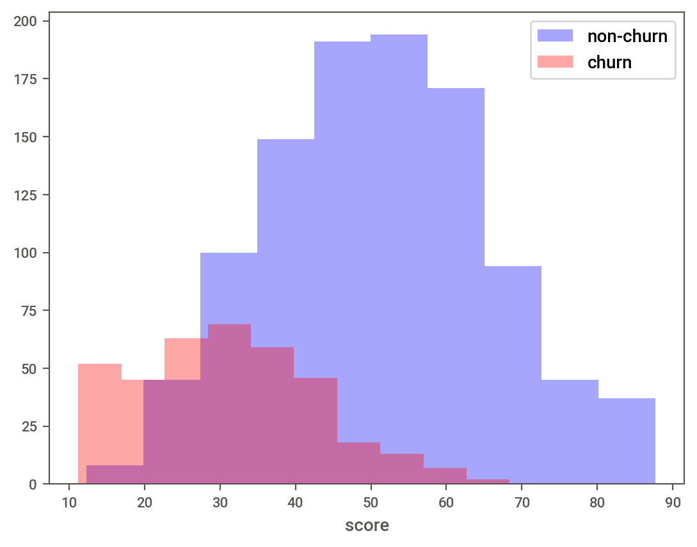

# Telco-Customer-Churn
## Project objectives and description

The dataset used in the project was sourced from: [Kaggle Telco Churn Dataset](https://www.kaggle.com/datasets/blastchar/telco-customer-churn/data).

The project analyzes customer data to develop a targeted retention program by predicting customer behavior, specifically churn. It involves:
- Exploring various machine learning models to predict customer churn
- Creating a production-ready scorecard to rank Telco customers by their likelihood of churn
- Utilizing feature engineering techniques, including binning variables and selecting the most predictive ones based on Information Value (IV) and Gini coefficients
- Applying Weight of Evidence (WoE) transformation to selected variables
- Grouping customers into deciles based on churn probability
- Assessing scorecard stability using Population Stability Index (PSI) and Characteristic Stability Index (CSI)

## Conclusion and recommendations
We created a customer attrition scorecard that evaluates clients based on their churn likelihood. The scorecard shows stellar performance, achieving:
- **ROC AUC of 87%** (Gini of 0.74)
- Outperforms most Kaggle competition models
- Effectively handles "evolved" out-of-sample data

Performance demonstrated by risk ranking distributions:

<!-- Side-by-side images using HTML table -->
<table>
  <tr>
    <td align="center">
      
       <em>Decile distribution of churn risk</em>
    </td>
    <td align="center">
      
       <em>Churn vs non-churn distribution</em>
    </td>
  </tr>
</table>

**Recommendations:**
1. Focus retention efforts on top 3 deciles (highest churn risk)
2. Monitor scorecard stability quarterly using PSI/CSI metrics
3. Explore additional models (XGBoost, Neural Networks)
4. Test alternative variable selection criteria

---

**Note:** Ensure both image files (`out_of_sample_decile_distribution.png` and `churn_no_churn_distribution.png`) are in your repository's root directory or adjust the paths accordingly.
