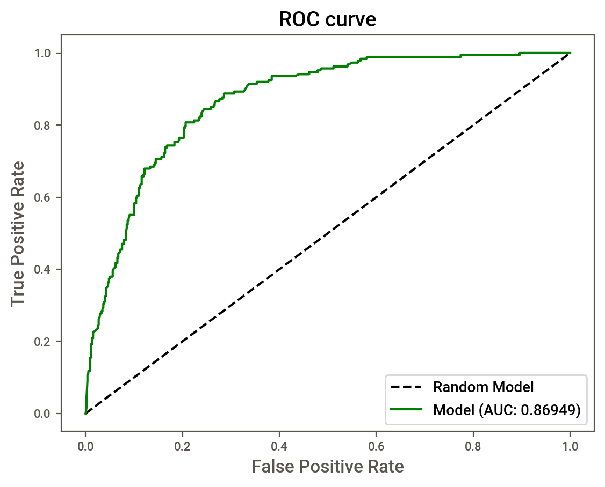
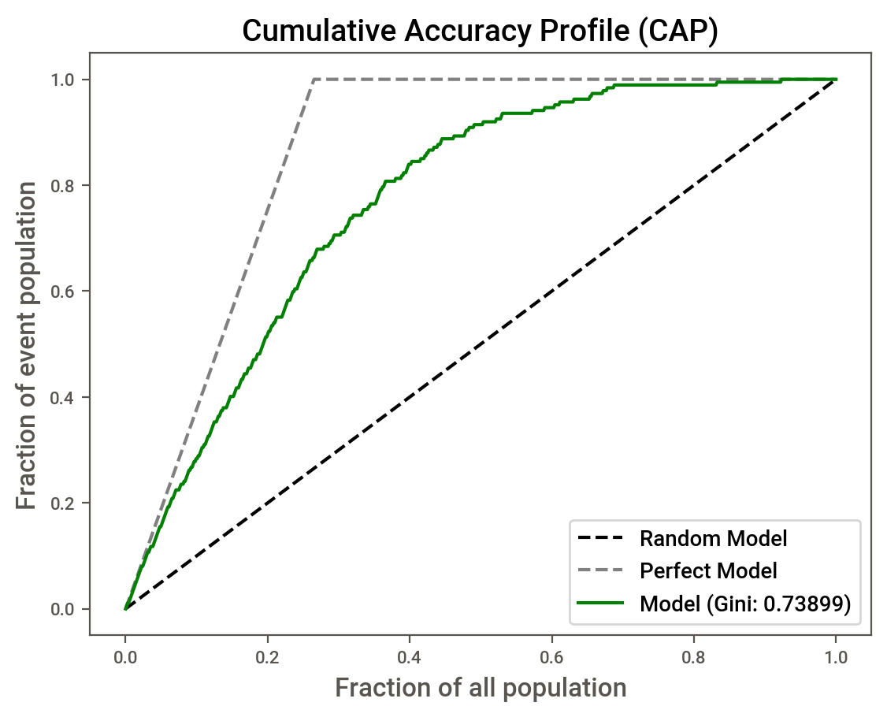

# Telco-Customer-Churn
- $\textbf{Author}$: Patrick Mthisi
- $\textbf{Contact details}$: patrickmthisi@hotmail.com

## Project objectives and description

The dataset used in the project was sourced from: [Kaggle Telco Churn Dataset](https://www.kaggle.com/datasets/blastchar/telco-customer-churn/data).

The project analyzes customer data to develop a targeted retention program by predicting customer behavior, specifically churn. It involves:
- Exploring various machine learning models to predict customer churn
- Creating a production-ready scorecard to rank Telco customers by their likelihood of churn
- Utilizing feature engineering techniques, including binning variables and selecting the most predictive ones based on Information Value (IV) and Gini coefficients
- Applying Weight of Evidence (WoE) transformation to selected variables
- Grouping customers into deciles based on churn probability
- Assessing scorecard stability using Population Stability Index (PSI) and Characteristic Stability Index (CSI)

## Conclusion and recommendations
In this project, we created a customer attrition scorecard that can be used to evaluate clients based on their likelihood of attrition. The scorecard shows stellar performance, achieving a ROC AUC of 87% (and Gini of 0.74), which is quite comparable, if not better, than most models that were presented on Kaggle by other participants:

<!-- Side-by-side images using borderless HTML table -->
<table style="border:none; border-collapse: collapse; width:100%; table-layout:fixed;">
  <tr style="border:none;">
    <td style="border:none; padding:0; text-align:center; width:50%;">
      
       <em>Test ROC AUC</em>
    </td>
    <td style="border:none; padding:0; text-align:center; width:50%;">
      
       <em>Test Gini</em>
    </td>
  </tr>
</table>

The performance of the scorecard was evaluated using out-of-sample "evolved" data. The scorecard effectively ranked risk, as demonstrated by the decile distribution and the churn versus non-churn distribution shown below:

<!-- Side-by-side images using borderless HTML table -->
<table style="border:none; border-collapse: collapse; width:100%; table-layout:fixed;">
  <tr style="border:none;">
    <td style="border:none; padding:0; text-align:center; width:50%;">
      
       <em>Decile distribution of churn risk</em>
    </td>
    <td style="border:none; padding:0; text-align:center; width:50%;">
      
       <em>Churn vs non-churn distribution</em>
    </td>
  </tr>
</table>

**Recommendations:**
1. Focus retention efforts on the top 3 deciles (highest churn risk)
2. Monitor scorecard stability quarterly using PSI/CSI metrics
3. Explore additional models (XGBoost, Neural Networks)
4. Test alternative variable selection criteria

---

